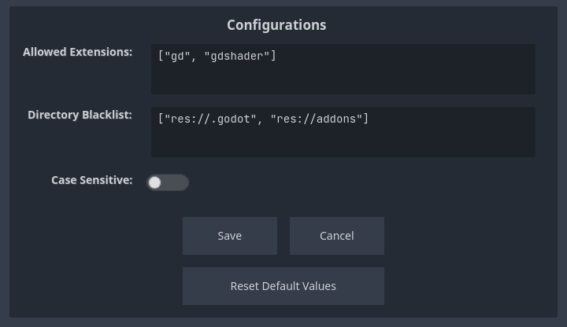

# Script Search

This is a Godot 4 plugin that provides a quick and easy way to search for scripts.

## How to Use

### Searching

Press `Ctrl+P` to open the Search Window. ([You can change this shortcut](#changing-the-shortcut))

Write part of the file name and the search results will be filtered.

Navigate with `Up` / `Down` Arrows and press `Enter` to select a file. The file will open in the script editor.

### Changing the Configurations

You can easily edit the Configurations by clicking the config button on the Search Window:

This will open the Configuration Window, where you can change the parameters:

  - `Allowed Extensions`: What extensions should be included in the search. 
    
    Default: `["gd", "gdshader"]`
  
  - `Directory Blacklist`: What directories should not be included in the search. 
    
    Default: `["res://.godot", "res://addons"]`
  
  - `Case Sensitive`: When enabled, differentiates upper and lower case text.
    
    Default: `false`
  

Click the `Save` button to apply the changes made to the configurations.

### Changing the shortcut

To modify the default shortcut, navigate to `Project > Project Settings`.

In the `Input Map` tab, add a new action called `addon_script_search_open` and assign an event to it, with the desired key combination:

Reload the plugin, and the new shortcut should take effect.

## Assets

Icons from [Onscreen Controls](https://kenney.nl/assets/onscreen-controls) by Kenney.
